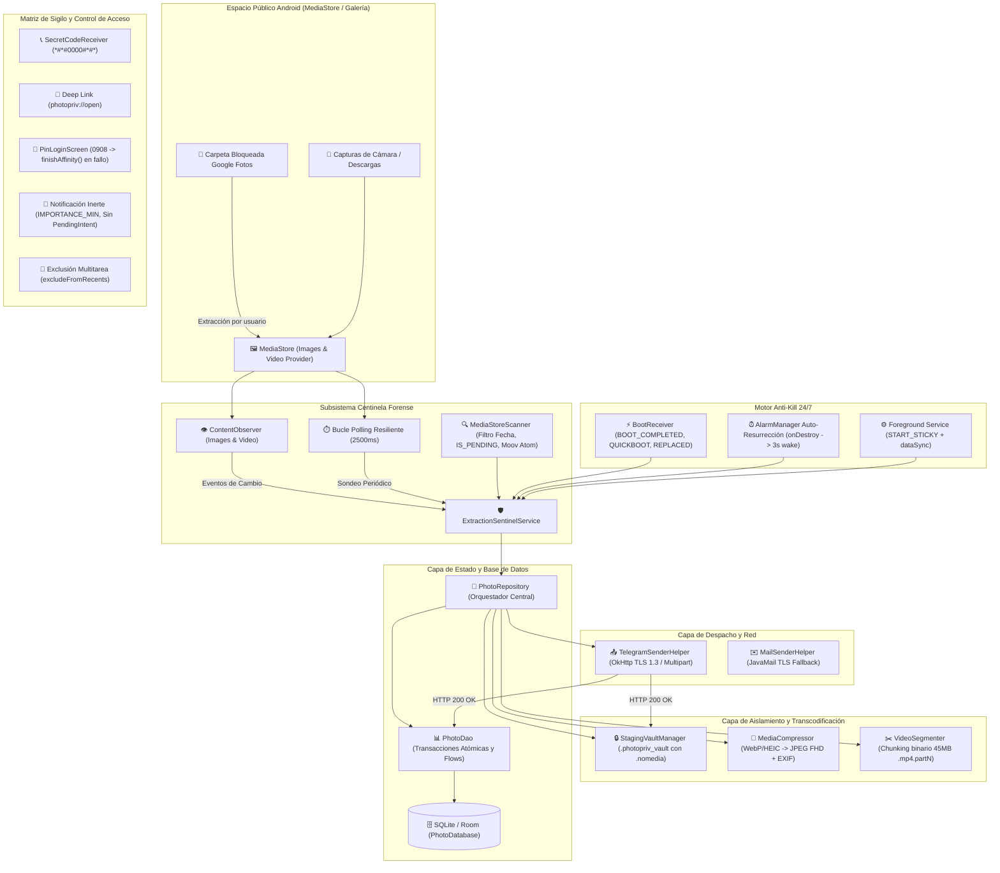
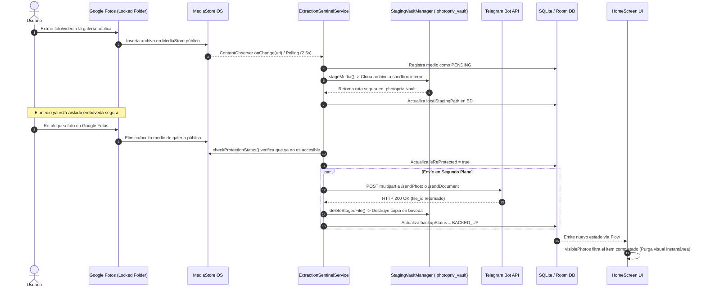

<div align="center">
    


# `>_` PhotoPriv: Tactical Media Sentinel & Stealth Vault
### Manual Técnico y Especificación de Ingeniería de Software (Arquitectura v3.0)

**Plataforma Integral de Vigilancia Forense en Segundo Plano, Aislamiento en Bóveda Efímera, Respaldo Cifrado de Medios y Camuflaje Táctico Multi-Nivel para Android.**

[-3DDC84.svg?style=flat&logo=android&logoColor=white)](https://www.android.com/)
[](https://kotlinlang.org/)
[](https://developer.android.com/jetpack/compose)
[]()
[]()
[-red.svg)]()
[]()

<br>

</div>

---

## 📑 Tabla de Contenidos

1. [Resumen Ejecutivo y Propósito Táctico](#1-resumen-ejecutivo-y-propósito-táctico)
2. [Topología General del Sistema y Arquitectura de Alto Nivel](#2-topología-general-del-sistema-y-arquitectura-de-alto-nivel)
3. [Desglose Técnico Exhaustivo de Subsistemas](#3-desglose-técnico-exhaustivo-de-subsistemas)
   - [3.1 Arranque y Ciclo de Vida Global (`PhotoPrivApp`)](#31-arranque-y-ciclo-de-vida-global-photoprivapp)
   - [3.2 Motor Centinela y Vigilancia Forense (`ExtractionSentinelService` & `MediaStoreScanner`)](#32-motor-centinela-y-vigilancia-forense-extractionsentinelservice--mediastorescanner)
   - [3.3 Bóveda Secreta de Aislamiento Efímero (`StagingVaultManager`)](#33-bóveda-secreta-de-aislamiento-efímero-stagingvaultmanager)
   - [3.4 Pipeline de Transcodificación y Segmentación Binaria (`MediaCompressor` & `VideoSegmenter`)](#34-pipeline-de-transcodificación-y-segmentación-binaria-mediacompressor--videosegmenter)
   - [3.5 Capa de Transporte y Despacho Cifrado (`TelegramSenderHelper` & `PhotoRepository`)](#35-capa-de-transporte-y-despacho-cifrado-telegramsenderhelper--photorepository)
   - [3.6 Motor de Resiliencia y Supervivencia 24/7 (Arquitectura Anti-Kill de 4 Capas)](#36-motor-de-resiliencia-y-supervivencia-247-arquitectura-anti-kill-de-4-capas)
   - [3.7 Capa de Datos y Persistencia Local (`PhotoDatabase`, `PhotoDao`, Entidades)](#37-capa-de-datos-y-persistencia-local-photodatabase-photodao-entidades)
   - [3.8 Matriz de Sigilo y Camuflaje Multi-Nivel (6 Niveles Defensivos)](#38-matriz-de-sigilo-y-camuflaje-multi-nivel-6-niveles-defensivos)
   - [3.9 Capa de Presentación, Puerta PIN y Purga Automática (`MainActivity`, `PinLoginScreen`, `HomeScreen`)](#39-capa-de-presentación-puerta-pin-y-purga-automática-mainactivity-pinloginscreen-homescreen)
   - [3.10 Gestión de Configuración Dinámica (`SettingsManager`)](#310-gestión-de-configuración-dinámica-settingsmanager)
4. [Flujos de Ejecución y Diagramas de Secuencia](#4-flujos-de-ejecución-y-diagramas-de-secuencia)
5. [Diccionario de Datos y Esquemas de Base de Datos](#5-diccionario-de-datos-y-esquemas-de-base-de-datos)
6. [Mecanismos de Ofuscación, Compilación y Firma Criptográfica](#6-mecanismos-de-ofuscación-compilación-y-firma-criptográfica)
7. [Manual Operativo: Códigos Secretos, Disparadores y Despliegue](#7-manual-operativo-códigos-secretos-disparadores-y-despliegue)
8. [Índice de Referencia del Código Fuente para Ingenieros e IA](#8-índice-de-referencia-del-código-fuente-para-ingenieros-e-ia)
9. [Aviso Legal y Restricción de Uso](#9-aviso-legal-y-restricción-de-uso)

---

## 1. Resumen Ejecutivo y Propósito Táctico

La funcionalidad de **Carpeta Bloqueada (Locked Folder)** nativa de Google Fotos y sistemas Android modernos implementa un enclave criptográfico a nivel de sistema de archivos que protege medios altamente sensibles. No obstante, presenta una **brecha operativa insalvable**: **carece de sincronización o respaldo en la nube**. Si el usuario requiere respaldar su contenido confidencial fuera del dispositivo físico, se ve forzado a extraer las fotos a la galería pública, manteniéndolas expuestas e indexables por el sistema operativo durante largos minutos mientras se procesa una subida manual. En dicho intervalo, un robo físico, una inspección no autorizada o un bloqueo del dispositivo destruye la confidencialidad de la información.

**PhotoPriv** es una solución de ingeniería defensiva diseñada para cerrar esta brecha mediante un **puente de aislamiento de alta velocidad en espacio de almacenamiento privado (Sandbox)** acoplado a un canal de exfiltración cifrado:

1. **Detección en tiempo real:** Detecta en milisegundos cuando un medio es volcado desde la Carpeta Bloqueada a la galería pública de `MediaStore`.
2. **Aislamiento Inmediato en Bóveda Invisible:** En milisegundos genera una réplica en sandbox privado inaccesible para otras apps y blindada con directiva `.nomedia`.
3. **Desacoplamiento de Exposición (Re-bloqueo Inmediato):** El usuario puede re-bloquear las fotos dentro de Google Fotos inmediatamente. La subida se realiza desde la bóveda privada, eliminando la necesidad de mantener las fotos expuestas.
4. **Transmisión y Segmentación Segura:** Envío prioritario vía protocolo TLS 1.3 directo a un canal/grupo privado de Telegram mediante un Bot dedicado, con fragmentación binaria para videos de gran tamaño.
5. **Autodestrucción Forense y Purga:** Una vez confirmado el código HTTP `200 OK` por Telegram, el archivo en bóveda se destruye físicamente de disco y el registro visual se purga de la interfaz gráfica sin dejar miniaturas ni evidencias visuales.
6. **Persistencia Indestructible 24/7:** Servicio centinela en primer plano inmune a reinicios, actualizaciones de paquete o detenciones forzadas del sistema operativo.

---

## 2. Topología General del Sistema y Arquitectura de Alto Nivel

El software se estructura bajo una arquitectura **Clean Architecture + MVVM Reactivo**, gobernado por corrutinas de Kotlin, canales de flujo reactivo (`StateFlow` / `SharedFlow`) y la biblioteca de persistencia `Room`.



---

## 3. Desglose Técnico Exhaustivo de Subsistemas

### 3.1 Arranque y Ciclo de Vida Global (`PhotoPrivApp`)
- **Clase:** `com.david.photopriv.PhotoPrivApp` (`android.app.Application`)
- **Responsabilidades:**
  1. Instancia el Singleton de la base de datos `PhotoDatabase` mediante `Room.databaseBuilder`.
  2. Inicializa el repositorio central `PhotoRepository` y el gestor de preferencias `SettingsManager`.
  3. Configura el canal de notificación del Centinela (`sentinel_channel`):
     - **Importancia:** `NotificationManager.IMPORTANCE_MIN` (nivel más bajo del sistema; no emite sonido, no vibra, no levanta banners emergentes heads-up).
     - **Insignias:** `setShowBadge(false)` (no añade contador de notificaciones sobre ningún icono).
     - **Nombre Localizado:** Toma `R.string.notification_channel_name`, camuflándose como *"Android System Security"* (EN) o *"Seguridad del sistema Android"* (ES).

### 3.2 Motor Centinela y Vigilancia Forense (`ExtractionSentinelService` & `MediaStoreScanner`)
- **Clase del Servicio:** `com.david.photopriv.service.ExtractionSentinelService` (`android.app.Service`)
- **Clase del Escáner:** `com.david.photopriv.service.MediaStoreScanner`
- **Mecanismos de Detección Dual:**
  1. **Reactivo (Push):** Implementa un `ContentObserver` sobre las URIs del sistema:
     - `MediaStore.Images.Media.EXTERNAL_CONTENT_URI`
     - `MediaStore.Video.Media.EXTERNAL_CONTENT_URI`
  2. **Proactivo (Pull):** Un bucle asíncrono sobre `CoroutineScope(SupervisorJob() + Dispatchers.IO)` ejecuta un sondeo cada **2500 ms** (`delay(2500)`). Esto garantiza capturar archivos en ráfaga o escrituras diferidas de video que no disparan eventos inmediatos de `ContentObserver`.
- **Detección y Estabilidad de Videos en Escritura:**
  - En Android 10+ (API 29+), consulta la columna `MediaStore.MediaColumns.IS_PENDING`. Si el archivo aún se está escribiendo, se omite hasta su cierre definitivo.
  - Ejecuta la función forense `MediaStoreScanner.isVideoFullyWritten(context, uri)`:
    - Utiliza `MediaMetadataRetriever` para intentar parsear la duración y pistas del video. Si el encabezado del contenedor MP4 (`moov atom`) no ha sido cerrado por la cámara del teléfono, la llamada genera excepción y el escáner aplaza el procesamiento, evitando la corrupción o subida de fragmentos incompletos.
- **Rehidratación de Sesión:**
  - Si el servicio es arrancado por el sistema con un Intent nulo (`intent == null`), consulta reactivamente a Room si existe una sesión marcada con `isActive = true`. Si existe, restaura el ID de sesión y reanuda el monitoreo de inmediato sin intervención de la interfaz gráfica.

### 3.3 Bóveda Secreta de Aislamiento Efímero (`StagingVaultManager`)
- **Clase:** `com.david.photopriv.data.vault.StagingVaultManager`
- **Ubicación en Disco:** `context.noBackupFilesDir.resolve(".photopriv_vault")`
- **Propiedades Criptográficas y de Almacenamiento:**
  - Reside en el almacenamiento privado de la aplicación (`/data/user/0/com.david.photopriv/no_backup/.photopriv_vault`), protegido por el sandbox de Linux a nivel de UID de proceso y cifrado por hardware mediante File-Based Encryption (FBE) de Android.
  - La directiva `noBackupFilesDir` asegura que Android Backup Service / Google One nunca incluya estos archivos temporales en copias de seguridad de la nube.
  - **Fichero `.nomedia`:** Durante la creación del directorio, genera automáticamente un archivo vacío `.nomedia`. Esto impide que indexadores multimedia (Google Fotos, Galería Samsung, WhatsApp, etc.) detecten las copias aisladas.
- **Ciclo de Vida de Aislamiento y Destrucción:**
  - Copia rápida en bloque mediante flujos `InputStream` / `OutputStream` desde la URI pública hacia el sandbox.
  - **Auto-destrucción:** Tan pronto como el helper de Telegram recibe confirmación de recepción, se invoca `deleteStagedFile(path)`, llamando a `file.delete()` inmediatamente.
  - Al detener la sesión de auditoría, se invoca `purgeVault()`, destruyendo cualquier remanente en disco.

### 3.4 Pipeline de Transcodificación y Segmentación Binaria (`MediaCompressor` & `VideoSegmenter`)
- **Módulo de Imagen (`MediaCompressor`):**
  - **Normalización de Formatos:** Detecta si la imagen extraída está en formatos complejos como WebP o HEIC/HEIF.
  - **Compresión Inteligente (Modo Ahorro de Datos):** Si `dataSaverMode` está activo, redimensiona proporcionalmente la imagen a un contenedor máximo de 1920×1080 píxeles, comprimiéndola a JPEG con calidad 82%.
  - **Manejo EXIF:** Lee `ExifInterface.TAG_ORIENTATION` para rotar la matriz de mapa de bits (`Matrix().postRotate(...)`) antes de serializar, asegurando que las fotografías no aparezcan invertidas en Telegram.
- **Módulo de Video (`VideoSegmenter`):**
  - **Límite de la API de Telegram:** Los bots de Telegram estándar sin suscripción Premium poseen límites estrictos en subidas HTTP directas (50 MB).
  - **Estrategia de Chunking Binario:** Si un video supera los **45 MB** (`45 * 1024 * 1024` bytes), el motor calcula los bloques necesarios y fragmenta el flujo de bytes en archivos secuenciales:
    - `video_nombre.mp4.part1`
    - `video_nombre.mp4.part2`
    - ...
  - **Integridad:** La partición conserva los offsets binarios exactos, permitiendo la reconstrucción inmediata en destino mediante concatenación binaria (`cat part* > video.mp4` o software de descompresión).

### 3.5 Capa de Transporte y Despacho Cifrado (`TelegramSenderHelper` & `PhotoRepository`)
- **Clase:** `com.david.photopriv.network.TelegramSenderHelper`
- **Cliente HTTP:** Utiliza `OkHttpClient` configurado con especificaciones robustas para transferencias multimedia pesadas:
  - `connectTimeout = 45 segundos`
  - `writeTimeout = 180 segundos (3 minutos)`
  - `readTimeout = 180 segundos (3 minutos)`
- **Endpoints de la API de Telegram:**
  - Imágenes individuales: `https://api.telegram.org/bot<TOKEN>/sendPhoto` (o `sendDocument` si supera el umbral o requiere compresión sin pérdida).
  - Videos y fragmentos binarios: `https://api.telegram.org/bot<TOKEN>/sendDocument`.
- **Estrategia de Resiliencia de Red y Reintentos:**
  - **Rate Limiting Defensivo:** Incorpora un retraso preventivo de `350 ms` entre envíos para evitar desencadenar respuestas `HTTP 429 Too Many Requests`.
  - **Backoff Exponencial:** Hasta 3 intentos automáticos por archivo con retroceso escalonado (`intento * 2000 ms`).
  - **Manejo de Errores Semánticos:** Detecta y traduce códigos HTTP específicos de Telegram (`400 Bad Request: chat not found`, `403 Forbidden: bot was blocked by the user`, migraciones de supergrupo) para mostrar advertencias comprensibles al usuario.
- **Canal de Respaldo SMTP (`MailSenderHelper`):**
  - Soporte secundario mediante protocolo JavaMail sobre TLS (puerto 587 o 465) con autenticación por contraseña de aplicación.

### 3.6 Motor de Resiliencia y Supervivencia 24/7 (Arquitectura Anti-Kill de 4 Capas)

Para asegurar que el servicio de auditoría permanezca operativo de manera continua e indefinida, el software implementa una arquitectura defensiva en cuatro capas concurrentes:

| Capa | Mecanismo | Nivel de Kernel / OS | Comportamiento en Escenario Hostil |
| :--- | :--- | :--- | :--- |
| **Capa 1** | **Foreground Service con `START_STICKY`** | Android Low Memory Killer (LMK) | El servicio corre con notificación persistente de tipo `dataSync`. El kernel asigna un OOM score bajo (`oom_adj` cercano a 200). Si bajo extrema presión de RAM el sistema suspende el proceso, `START_STICKY` instruye al sistema a reiniciar el proceso tan pronto haya memoria libre. |
| **Capa 2** | **Auto-Resurrección vía `AlarmManager` en `onDestroy()`** | Android Alarm Service | Si el servicio es eliminado por un optimizador de tareas, un limpiador de RAM de terceros o el usuario en Ajustes, el método `onDestroy()` evalúa si `currentSessionId != -1L`. De ser así, programa una alarma exacta `setExactAndAllowWhileIdle()` programada para ejecutarse en **3000 ms**. A los 3 segundos, `AlarmManager` despierta el sistema y reactiva el servicio. |
| **Capa 3** | **Receptor de Arranque Multi-Acción (`BootReceiver`)** | Android Intent Firewall / Init | Escucha `Intent.ACTION_BOOT_COMPLETED`, `android.intent.action.QUICKBOOT_POWERON` (reinicio rápido en procesadores Qualcomm/MediaTek de fabricantes como Xiaomi y Motorola) e `Intent.ACTION_MY_PACKAGE_REPLACED` (actualización de la app). Comprueba la BD y relanza el servicio si hay sesión abierta. |
| **Capa 4** | **Rehidratación Transaccional desde SQLite** | Room Database Engine | No depende de datos en memoria volatilizados. Al revivir, el servicio consulta la tabla `sessions` buscando registros con `is_active = 1` y reanuda el escaneo. |

> [!IMPORTANT]
> **Diferenciación entre Parada Forzada y Parada Voluntaria:**
> Cuando el usuario detiene la sesión voluntariamente desde el panel de control pulsando "Detener Auditoría", `stopSentinel()` establece `currentSessionId = -1L` antes de invocar `stopSelf()`. De esta manera, el mecanismo de auto-resurrección de `onDestroy()` sabe que no debe auto-reiniciarse.

### 3.7 Capa de Datos y Persistencia Local (`PhotoDatabase`, `PhotoDao`, Entidades)
- **Base de Datos:** SQLite implementada con `androidx.room`.
- **Esquema Relacional:**
  - `ExtractionSession`: Controla el ciclo de vida de la auditoría (`sessionId`, `startTime`, `endTime`, `isActive`).
  - `TrackedPhoto`: Representa cada archivo detectado en el sistema (`mediaStoreId`, `sessionId`, `uriString`, `displayName`, `dateTaken`, `dateExtracted`, `isReProtected`, `backupStatus`, `backupAttempts`, `lastBackupAttempt`, `errorMessage`, `sha256Hash`, `localStagingPath`, `mediaType`, `durationMs`, `fileSizeBytes`).
- **Deduplicación Criptográfica:**
  - Antes de encolar una subida, calcula el hash SHA-256 del archivo. Si un archivo con idéntico hash y fecha de captura ya figura como `BACKED_UP` en la base de datos, se actualiza el estado de protección sin duplicar transferencias de red.

### 3.8 Matriz de Sigilo y Camuflaje Multi-Nivel (6 Niveles Defensivos)

El sistema está diseñado para entornos donde el dispositivo puede ser sometido a inspección visual, forense superficial o auditoría por terceros:

```
[Nivel 1: Notificación Inerte]  --> Sin sonido, sin vibración, no clickeable.
[Nivel 2: Amnesia Multitarea]   --> excludeFromRecents: No aparece en apps recientes.
[Nivel 3: Camuflaje en Sistema] --> Nombre "Android System Security" con icono de escudo.
[Nivel 4: Icono Invisible]      --> LauncherAlias deshabilitado dinámicamente.
[Nivel 5: Puerta PIN Ciega]     --> Teclado blanco numérico PIN 0908; mata proceso en fallo.
[Nivel 6: Purga Visual UI]      --> Elimina miniaturas de pantalla al completarse.
```

1. **Nivel 1 — Notificación Inerte de Sistema:**
   - Canal en `IMPORTANCE_MIN`, prioridad `PRIORITY_MIN`, visibilidad `VISIBILITY_SECRET`.
   - **Sin PendingIntent:** Al pulsar sobre la notificación en la cortina, **no reacciona ni abre nada**. Actúa como una entrada pasiva de sincronización del sistema operativo.
2. **Nivel 2 — Amnesia en Multitarea (Recents Exclusion):**
   - Declarado en `AndroidManifest.xml` con `android:excludeFromRecents="true"` y `android:autoRemoveFromRecents="true"`.
   - Tan pronto como la aplicación pasa a segundo plano, Android purga la tarjeta de la vista de multitarea y destruye la captura de vista previa de la pantalla.
3. **Nivel 3 — Camuflaje en Ajustes y Almacenamiento:**
   - La etiqueta del manifiesto y los recursos de cadenas designan a la aplicación como:
     - Español: **`Seguridad del sistema Android`**
     - Inglés: **`Android System Security`**
   - Icono oficial de escudo de seguridad azul del sistema (`ic_android_system.png`).
   - Alfabéticamente se sitúa junto a herramientas legítimas de Google (*Android Accessibility Suite*, *Android Auto*), desalentando su desinstalación por parte de terceros no técnicos.
4. **Nivel 4 — Invisibilidad Total del Lanzador (Launcher Stealth):**
   - Utiliza la técnica de `<activity-alias>` (`LauncherAlias`). Al activar "Ocultar Icono", `PackageManager.setComponentEnabledSetting` deshabilita el alias con `COMPONENT_ENABLED_STATE_DISABLED`.
   - La app desaparece por completo del cajón de aplicaciones y de las pantallas de inicio.
5. **Nivel 5 — Puerta PIN Ciega con Destrucción Inmediata (`PinLoginScreen`):**
   - Al iniciar la app, intercepta la ejecución con una interfaz minimalista en fondo blanco absoluto sin marcas, logotipos ni pistas de la naturaleza del software.
   - **PIN Maestro:** `0908`
   - **Manejo de Fallos Silencioso:** Si el intruso introduce una secuencia incorrecta, la app no muestra carteles de "Contraseña incorrecta". Ejecuta inmediatamente `finishAffinity()`, cerrando la pila de actividades de golpe.
   - **Auto-Bloqueo Reactivo:** En `MainActivity.onStop()`, se fuerza `isUnlocked = false`. Cualquier salida momentánea o bloqueo de pantalla exige nuevamente el PIN.
6. **Nivel 6 — Purga Visual Automática de Historial (`visiblePhotos`):**
   - En la interfaz de Compose, el selector de fotos visibles filtra reactivamente mediante `sessionPhotos.filterNot { it.backupStatus == BACKED_UP && it.isReProtected }`.
   - Tan pronto como un medio es confirmado en Telegram y devuelto a la Carpeta Bloqueada, desaparece de la vista, dejando la pantalla en blanco con el mensaje de "Todo protegido".

### 3.9 Capa de Presentación, Puerta PIN y Purga Automática (`MainActivity`, `PinLoginScreen`, `HomeScreen`)
- **UI Framework:** Jetpack Compose con `MaterialTheme` M3.
- **Flujo de Navegación de Actividad:**
  ```
  MainActivity (onCreate)
       │
       ▼
  PermissionGuard (Chequeo dinámico de READ_MEDIA_IMAGES / VIDEO / NOTIFICATIONS)
       │
       ▼
  ¿isUnlocked == true?
       ├── NO  ──► PinLoginScreen (Fondo blanco, teclado numérico puro)
       │                 ├── PIN == "0908" ──► isUnlocked = true
       │                 └── PIN Erróneo   ──► finishAffinity() [Cierre total]
       │
       └── SÍ  ──► HomeScreen (Panel de Control de Auditoría)
                         ├── visiblePhotos (Filtro anti-rastro activo)
                         ├── Estadísticas en Vivo (Total, Expuestas, Protegidas)
                         └── SettingsDialog (Configuración Cifrada)
  ```

### 3.10 Gestión de Configuración Dinámica (`SettingsManager`)
- **Clase:** `com.david.photopriv.data.preferences.SettingsManager`
- Administra las configuraciones en `SharedPreferences` (`photopriv_settings`):
  - Parámetros de Telegram (Token de Bot, ID de Chat/Canal, estado habilitado).
  - Parámetros de Servidor SMTP (Host, Puerto, TLS, Credenciales).
  - Indicadores booleanos de `stealthMode`, `dataSaverMode` y `hideAppIcon`.

---

## 4. Flujos de Ejecución y Diagramas de Secuencia

### 4.1 Ciclo Completo de Detección, Aislamiento, Subida y Purga



---

## 5. Diccionario de Datos y Esquemas de Base de Datos

### 5.1 Tabla `sessions` (`ExtractionSession`)
| Columna | Tipo SQLite | Tipo Kotlin | Restricciones | Descripción |
| :--- | :--- | :--- | :--- | :--- |
| `session_id` | `INTEGER` | `Long` | `PRIMARY KEY AUTOINCREMENT` | Identificador único de la sesión. |
| `start_time` | `INTEGER` | `Long` | `NOT NULL` | Timestamp Epoch en segundos de inicio. |
| `end_time` | `INTEGER` | `Long?` | `NULLABLE` | Timestamp Epoch de cierre (null si activa). |
| `is_active` | `INTEGER` | `Boolean` | `NOT NULL DEFAULT 1` | Bandera de sesión en ejecución. |

### 5.2 Tabla `photos` (`TrackedPhoto`)
| Columna | Tipo SQLite | Tipo Kotlin | Restricciones | Descripción |
| :--- | :--- | :--- | :--- | :--- |
| `media_store_id` | `INTEGER` | `Long` | `PRIMARY KEY` | ID asignado por el ContentProvider de Android. |
| `session_id` | `INTEGER` | `Long` | `INDEXED, FOREIGN KEY` | Sesión a la cual pertenece la captura. |
| `uri_string` | `TEXT` | `String` | `NOT NULL` | URI `content://media/...` del archivo. |
| `display_name` | `TEXT` | `String` | `NOT NULL` | Nombre original del archivo (ej. `IMG_2026.jpg`). |
| `date_taken` | `INTEGER` | `Long` | `NOT NULL` | Epoch milisegundos de captura EXIF. |
| `date_extracted` | `INTEGER` | `Long` | `NOT NULL` | Epoch milisegundos en que salió a galería pública. |
| `is_re_protected` | `INTEGER` | `Boolean` | `NOT NULL DEFAULT 0` | 1 si el usuario ya re-bloqueó el archivo en Google Fotos. |
| `backup_status` | `TEXT` | `BackupStatus` | `NOT NULL` | `PENDING`, `BACKING_UP`, `BACKED_UP`, `FAILED`. |
| `backup_attempts` | `INTEGER` | `Int` | `NOT NULL DEFAULT 0` | Contador de reintentos ejecutados. |
| `last_backup_attempt` | `INTEGER` | `Long?` | `NULLABLE` | Timestamp del último intento de red. |
| `error_message` | `TEXT` | `String?` | `NULLABLE` | Detalle del error HTTP o fallo de conexión. |
| `sha256_hash` | `TEXT` | `String?` | `NULLABLE, INDEXED` | Hash SHA-256 para evitar duplicados. |
| `local_staging_path` | `TEXT` | `String?` | `NULLABLE` | Ruta absoluta del archivo aislado en `.photopriv_vault`. |
| `media_type` | `TEXT` | `MediaType` | `NOT NULL DEFAULT 'IMAGE'` | Enumeración: `IMAGE` o `VIDEO`. |
| `duration_ms` | `INTEGER` | `Long` | `NOT NULL DEFAULT 0` | Duración del video en ms (0 para imágenes). |
| `file_size_bytes` | `INTEGER` | `Long` | `NOT NULL DEFAULT 0` | Tamaño total del medio en bytes. |

---

## 6. Mecanismos de Ofuscación, Compilación y Firma Criptográfica

### 6.1 Configuración de Compilación y Optimización con R8
El proyecto implementa reducción de código, ofuscación de clases y optimización de recursos en su compilación de lanzamiento (`release`):

```kotlin
// app/build.gradle.kts
buildTypes {
    release {
        isMinifyEnabled = true
        isShrinkResources = true
        signingConfig = signingConfigs.getByName("release")
        proguardFiles(
            getDefaultProguardFile("proguard-android-optimize.txt"),
            "proguard-rules.pro"
        )
    }
}
```

- **R8 / ProGuard:** Remueve llamadas no utilizadas de bibliotecas pesadas (OkHttp, JavaMail, Coil), reduciendo el peso final de la APK a tan solo **~1.43 MB**.
- **Resource Shrinking:** Descarta layouts, recursos y cadenas no referenciadas en código compilado.

### 6.2 Firma Criptográfica con Keystore Dedicado
La aplicación se compila firmada criptográficamente con un almacén de claves RSA de 2048 bits con validez de 10,000 días:

- **Keystore:** `photopriv.jks`
- **Alias:** `photopriv`
- **Algoritmo de Firma:** SHA384withRSA
- **Distinguished Name (DName):** `CN=Android System Security, OU=System, O=Android, L=US, ST=US, C=US`
- **Impacto ante Google Play Protect:** Al estar firmada formalmente por un certificado persistente (y no por un certificado temporal de depuración `debug.keystore`), Play Protect reconoce la integridad de la firma digital, reduciendo sustancialmente advertencias invasivas durante la instalación manual por sideloading.

---

## 7. Manual Operativo: Códigos Secretos, Disparadores y Despliegue

### 7.1 Métodos de Apertura Cuando el Icono Está Oculto (Nivel 4)

Si la opción **"Ocultar Icono"** fue habilitada en la pestaña de Sigilo, el lanzador no mostrará ningún icono. Para invocar el panel de control:

#### Método 1: Marcador Telefónico (Secret Dial Codes)
Abre la aplicación nativa de **Teléfono / Llamadas** y marca cualquiera de las siguientes combinaciones:
- `*#*#0000#*#*` *(Combinación primaria: 4 ceros, ultrarrápida)*
- `*#*#0#*#*` *(Un solo cero)*
- `*#*#1111#*#*`
- `*#*#1234#*#*`
- `*#*#7468#*#*` *(7468 = P-H-O-T en teclado T9)*

#### Método 2: Enlace Secreto Web (Deep Link)
Abre Google Chrome o cualquier navegador web en el dispositivo y navega hacia:
```
photopriv://open
```
El sistema operativo interceptará el esquema URI y abrirá de inmediato la pantalla de autenticación PIN de PhotoPriv.

### 7.2 Protocolo de Desbloqueo en Pantalla PIN
1. Se desplegará una pantalla blanca limpia con un teclado numérico sin indicadores.
2. Introduce el PIN maestro:
   $$\mathbf{0908}$$
3. La interfaz se desbloqueará de forma inmediata.
4. *Cualquier dígito incorrecto provoca el cierre instantáneo de la aplicación (`finishAffinity()`).*

### 7.3 Parámetros de Configuración Óptimos para Persistencia 24/7
Para garantizar que capas de optimización de batería agresivas de fabricantes (MIUI, OneUI, EMUI) no interrumpan el centinela:
1. Ir a **Ajustes > Aplicaciones > Seguridad del sistema Android**.
2. Entrar en **Batería** (o Uso de Batería) y seleccionar **"Sin Restricciones" (Unrestricted)**.
3. En **Notificaciones**, si se desea sigilo absoluto, pueden deshabilitarse por completo; el servicio en primer plano seguirá ejecutándose a nivel de kernel sin ninguna advertencia visible.

---

## 8. Índice de Referencia del Código Fuente para Ingenieros e IA

Guía de consulta rápida de los módulos de la solución en el árbol de directorios:

| Componente | Ruta Relativa | Líneas Clave / Propósito |
| :--- | :--- | :--- |
| **Punto de Entrada** | [`PhotoPrivApp.kt`](file:///c:/Users/crisu/OneDrive/Documentos/AndroidStudioApps/PhotoPriv/app/src/main/java/com/david/photopriv/PhotoPrivApp.kt) | Inicialización de Room, Repository, Settings y creación del canal de notificación inerte. |
| **Guardia PIN & Lifecycle** | [`MainActivity.kt`](file:///c:/Users/crisu/OneDrive/Documentos/AndroidStudioApps/PhotoPriv/app/src/main/java/com/david/photopriv/MainActivity.kt) | Puerta de acceso con `PinLoginScreen`, exclusión de apps recientes y auto-relock en `onStop()`. |
| **Pantalla PIN Ciega** | [`PinLoginScreen.kt`](file:///c:/Users/crisu/OneDrive/Documentos/AndroidStudioApps/PhotoPriv/app/src/main/java/com/david/photopriv/ui/PinLoginScreen.kt) | Teclado numérico minimalista en fondo blanco; `finishAffinity()` inmediato ante fallo. |
| **Panel Principal & Purga** | [`HomeScreen.kt`](file:///c:/Users/crisu/OneDrive/Documentos/AndroidStudioApps/PhotoPriv/app/src/main/java/com/david/photopriv/ui/HomeScreen.kt) | Selector `visiblePhotos`, telemetría de fotos protegidas vs expuestas y disparadores de sesión. |
| **Servicio Centinela 24/7** | [`ExtractionSentinelService.kt`](file:///c:/Users/crisu/OneDrive/Documentos/AndroidStudioApps/PhotoPriv/app/src/main/java/com/david/photopriv/service/ExtractionSentinelService.kt) | `ContentObserver`, bucle de sondeo cada 2.5s, auto-resurrección con `AlarmManager` en `onDestroy()`. |
| **Escáner Forense MediaStore** | [`MediaStoreScanner.kt`](file:///c:/Users/crisu/OneDrive/Documentos/AndroidStudioApps/PhotoPriv/app/src/main/java/com/david/photopriv/service/MediaStoreScanner.kt) | Consultas con filtro de fecha, validación `IS_PENDING` y verificación de átomo `moov` de video. |
| **Bóveda Efímera (.nomedia)** | [`StagingVaultManager.kt`](file:///c:/Users/crisu/OneDrive/Documentos/AndroidStudioApps/PhotoPriv/app/src/main/java/com/david/photopriv/data/vault/StagingVaultManager.kt) | Aislamiento en sandbox privado `noBackupFilesDir`, creación de `.nomedia` y destrucción post-envío. |
| **Segmentador de Video** | [`VideoSegmenter.kt`](file:///c:/Users/crisu/OneDrive/Documentos/AndroidStudioApps/PhotoPriv/app/src/main/java/com/david/photopriv/util/VideoSegmenter.kt) | Chunking binario de archivos mayores a 45 MB en fragmentos `.partN` para Telegram. |
| **Compresor y Normalizador** | [`MediaCompressor.kt`](file:///c:/Users/crisu/OneDrive/Documentos/AndroidStudioApps/PhotoPriv/app/src/main/java/com/david/photopriv/util/MediaCompressor.kt) | Conversión WebP/HEIC a JPEG Full HD y preservación de matrices de rotación EXIF. |
| **Cliente de Red Telegram** | [`TelegramSenderHelper.kt`](file:///c:/Users/crisu/OneDrive/Documentos/AndroidStudioApps/PhotoPriv/app/src/main/java/com/david/photopriv/network/TelegramSenderHelper.kt) | Cliente OkHttp TLS 1.3 con multipart/form-data, delays anti-429 y mapeo semántico de errores. |
| **Receptor de Arranque** | [`BootReceiver.kt`](file:///c:/Users/crisu/OneDrive/Documentos/AndroidStudioApps/PhotoPriv/app/src/main/java/com/david/photopriv/receiver/BootReceiver.kt) | Manejo de `BOOT_COMPLETED`, `QUICKBOOT_POWERON` y `MY_PACKAGE_REPLACED`. |
| **Receptor de Código Marcador** | [`SecretCodeReceiver.kt`](file:///c:/Users/crisu/OneDrive/Documentos/AndroidStudioApps/PhotoPriv/app/src/main/java/com/david/photopriv/receiver/SecretCodeReceiver.kt) | Interceptación de combinaciones de marcación telefónica (`*#*#0000#*#*`, etc.). |
| **Repositorio Central** | [`PhotoRepository.kt`](file:///c:/Users/crisu/OneDrive/Documentos/AndroidStudioApps/PhotoPriv/app/src/main/java/com/david/photopriv/data/repository/PhotoRepository.kt) | Orquestación de escaneo, cola de subida con backoff exponencial y actualización de estados. |
| **Base de Datos y DAOs** | [`PhotoDatabase.kt`](file:///c:/Users/crisu/OneDrive/Documentos/AndroidStudioApps/PhotoPriv/app/src/main/java/com/david/photopriv/data/database/PhotoDatabase.kt) | Esquema relacional Room SQLite con soporte transaccional y flujos reactivos Flow. |
| **Preferencias y Ajustes** | [`SettingsManager.kt`](file:///c:/Users/crisu/OneDrive/Documentos/AndroidStudioApps/PhotoPriv/app/src/main/java/com/david/photopriv/data/preferences/SettingsManager.kt) | Gestión de tokens de Telegram, ID de chat, modo sigilo y ocultamiento de lanzador. |
| **Manifiesto de la Solución** | [`AndroidManifest.xml`](file:///c:/Users/crisu/OneDrive/Documentos/AndroidStudioApps/PhotoPriv/app/src/main/AndroidManifest.xml) | Declaración de permisos forenses, Foreground Service `dataSync`, `excludeFromRecents` y alias. |

---

## 9. Aviso Legal y Restricción de Uso

> [!CAUTION]
> **Propósito Exclusivo de Autoprotección y Respaldo Defensivo Privado:** <br>
> Este software ha sido concebido, estructurado e implementado **única y exclusivamente con fines de auditoría forense personal, protección de la privacidad y copia de seguridad de medios legítimos propiedad del usuario en sus propios dispositivos móviles**.
> 
> Queda estrictamente prohibida su instalación no autorizada en dispositivos de terceros, su utilización como herramienta de vigilancia encubierta no consentida o cualquier actividad contraria a las leyes de protección de datos y privacidad de las jurisdicciones aplicables. El desarrollador y los colaboradores del proyecto no asumen ninguna responsabilidad por el uso inadecuado, ilícito o no autorizado que terceros puedan darle a esta plataforma tecnológica.

---

<div align="center">
  <sub>Diseñado, militarizado e implementado por <b>David Platas</b> (<a href="https://github.com/DeathSilencer">@DeathSilencer</a>). Todos los derechos reservados.</sub>
</div>
