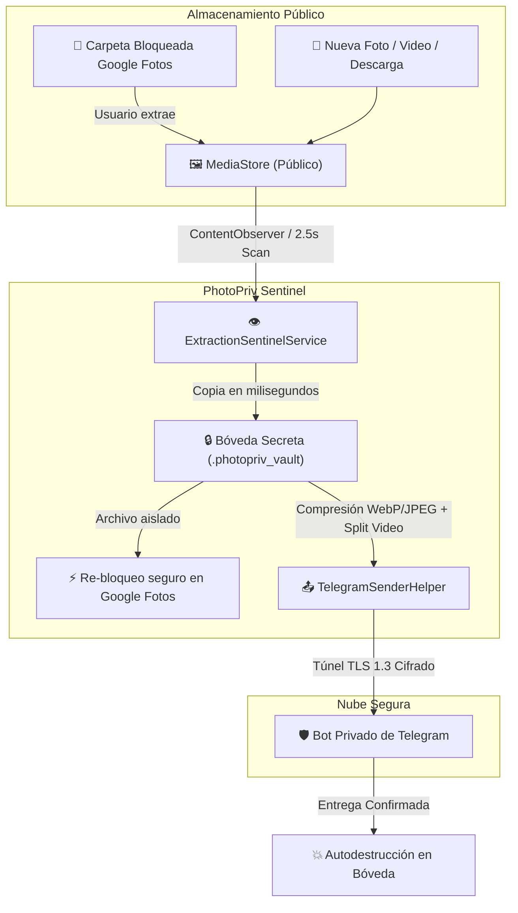

    

# `>_` PhotoPriv: Tactical Media Sentinel & Stealth Vault

**Plataforma Defensiva de Auditoría Forense, Aislamiento en Bóveda Invisible y Respaldo Táctico para Android.**

[-red.svg)]()

 

| 🛡️ | **Versión** | **Descripción y Novedades del Sistema** |
| :---: | :--- | :--- |
| **v3.0** | 🚀 **Producción** | *Suite de Seguridad Táctica y Vigilancia Continua: Centinela 24/7 + Bóveda Efímera Auto-destructiva + Respaldo Cifrado a Telegram.*    

<strong>✨ Clic para ver Novedades de la Suite v3.0</strong>
 Esta actualización consolida una suite defensiva militarizada para la protección de archivos privados:  <b>🛡️ Núcleo Táctico y Respaldo Defensivo</b><ul><li><b>Bóveda Secreta de Aislamiento (Staging Vault):</b> Copia instantánea en milisegundos en sandbox interno con <code>.nomedia</code>. Permite re-bloquear fotos en Google Fotos inmediatamente sin esperar que termine la subida.</li><li><b>Auto-destrucción sin Rastro:</b> El archivo aislado se destruye permanentemente en cuanto Telegram confirma la recepción exitosa.</li><li><b>Motor de Video Segmentado:</b> División binaria automática para videos &gt; 45 MB con reconstrucción íntegra.</li><li><b>Conversión WebP/HEIC a JPEG:</b> Compatible con visualizadores estándar sin pérdida de metadatos de orientación.</li><li><b>Vigilancia 24/7 con Auto-reinicio:</b> <code>BootReceiver</code> reactiva el Centinela tras apagados o reinicios del teléfono.</li><li><b>Blindaje Contra Inspección (Niveles 1 a 4):</b> Disfraz de <code>Android System Security</code> en Almacenamiento, exclusión de apps recientes, notificación inerte no clickeable y desaparición de icono con marcación telefónica (<code>*#*#0000#*#*</code>).</li></ul>
 |

 

---

    
<strong>Desplegar Tabla de Contenidos</strong>

    
 
        
- [`>_` PhotoPriv: Tactical Media Sentinel & Stealth Vault](#_-photopriv-tactical-media-sentinel--stealth-vault)
  - [`>_` Propósito Táctico](#_-propósito-táctico)
  - [`>_` 🛡️ Arquitectura Defensiva](#_--arquitectura-defensiva)
    - [1. Bóveda Secreta de Aislamiento (Stealth Staging Vault)](#1-bóveda-secreta-de-aislamiento-stealth-staging-vault)
    - [2. Centinela Forense 24/7 (Extraction Sentinel)](#2-centinela-forense-247-extraction-sentinel)
    - [3. Motor de Transmisión Táctica a Telegram](#3-motor-de-transmisión-táctica-a-telegram)
  - [`>_` 🥷 Matriz de Sigilo Defensivo (4 Niveles de Infiltración)](#_--matriz-de-sigilo-defensivo-4-niveles-de-infiltración)
  - [`>_` ⚙️ Instalación y Despliegue](#_--instalación-y-despliegue)
    - [1. Configuración del Bot de Telegram](#1-configuración-del-bot-de-telegram)
    - [2. Configuración Esencial de Batería (Persistencia 24/7)](#2-configuración-esencial-de-batería-persistencia-247)
    - [3. Modo Silencio Absoluto (Cero Notificaciones)](#3-modo-silencio-absoluto-cero-notificaciones)
  - [`>_` ❓ Solución de Problemas (FAQ)](#_--solución-de-problemas-faq)
  - [`>_` 🔐 Privacidad por Diseño y Seguridad](#_--privacidad-por-diseño-y-seguridad)
  - [`>_` 🙌 Créditos y Desarrollador](#_--créditos-y-desarrollador)
    - [`>_` ⚖️ Aviso Legal (Disclaimer)](#_-️-aviso-legal-disclaimer)

---

## `>_` Propósito Táctico

La función de **Carpeta Bloqueada (Locked Folder)** de Google Fotos es una de las herramientas más seguras de Android para proteger contenido confidencial; sin embargo, adolece de una debilidad crítica: **no permite copias de seguridad automáticas a la nube privada** sin forzar al usuario a desbloquear y exponer sus archivos en la galería pública durante largos minutos mientras se suben.

Si alguien roba el dispositivo o toma el control mientras las fotos están en la galería esperando subirse, **la privacidad se vulnera por completo**.

**PhotoPriv resuelve este dilema mediante un protocolo de aislamiento y exfiltración ultrarrápido:**
1. **Detección Inmediata:** En el milisegundo en que un archivo sale de la Carpeta Bloqueada (o se toma/descarga un archivo nuevo), el Centinela lo detecta.
2. **Aislamiento en Bóveda Invisible:** Duplica el archivo en una bóveda secreta interna en milisegundos.
3. **Re-bloqueo Instantáneo:** El usuario puede re-bloquear las fotos en Google Fotos de inmediato. Ya no hay que esperar a que termine la subida.
4. **Despacho Seguro:** La app transmite el archivo por un túnel cifrado TLS a un bot privado de Telegram.
5. **Autodestrucción:** Una vez confirmada la entrega, la copia temporal se elimina definitivamente sin dejar rastro.

---

## `>_` 🛡️ Arquitectura Defensiva

### 1. Bóveda Secreta de Aislamiento (Stealth Staging Vault)
* **Ubicación:** `context.noBackupFilesDir/.photopriv_vault/` en el almacenamiento aislado de la app (`/data/user/0/...`).
* **Invisibilidad Absoluta:**
  * Protegido por una directiva `.nomedia` para que galerías, Google Fotos o WhatsApp no indexen su contenido.
  * No se sincroniza en copias de seguridad convencionales de Android (`noBackupFilesDir`).
* **Auto-destrucción:** Cada archivo se elimina del disco en el instante exacto en que Telegram responde con `200 OK`. Al cerrar la sesión, la carpeta completa es purgada.

### 2. Centinela Forense 24/7 (Extraction Sentinel)
* **Vigilancia reactiva:** Combina un `ContentObserver` sobre `MediaStore.Images` y `MediaStore.Video` con un sondeo cada 2.5 segundos.
* **Integridad de Videos Pesados:** Emplea `MediaMetadataRetriever` para confirmar que el contenedor MP4 (`moov atom`) esté cerrado y completamente escrito por el sistema antes de iniciar la subida, evitando archivos corruptos.
* **Persistencia Militar:**
  * `START_STICKY`: Si el sistema reclama memoria temporalmente, el kernel vuelve a levantar el servicio.
  * `BootReceiver` con `RECEIVE_BOOT_COMPLETED`: Si el teléfono se apaga o reinicia, el Centinela revive automáticamente sin intervención humana.

### 3. Motor de Transmisión Táctica a Telegram
* **Segmentación Binaria de Video:** Divide automáticamente videos superiores a 45 MB en bloques `.mp4.part1`, `.mp4.part2` compatibles, permitiendo saltarse los límites de subida de la API de Telegram.
* **Normalización de Formato y Orientación:** Transforma imágenes problemáticas (WebP o HEIC) a JPEG optimizado, recalculando la rotación EXIF de la cámara para que nunca se reciban fotos o videos volteados.
* **Cola con Reintentos Automáticos:** Esquema de 3 intentos progresivos con respaldo en SQLite/Room Database.

---

## `>_` 🥷 Matriz de Sigilo Defensivo (4 Niveles de Infiltración)

Diseñado para operar en escenarios donde el teléfono puede ser inspeccionado por terceros o intrusos:

| Nivel | Capa de Seguridad | Comportamiento Táctico |
| :---: | :--- | :--- |
| **Nivel 1** | **Notificación Inerte de Sistema** | El canal opera en `IMPORTANCE_MIN`. No emite sonido ni vibración, no muestra icono en barra superior ni pantalla de bloqueo. **Al tocarla no abre nada** (sin `PendingIntent`); parece un servicio pasivo del sistema. |
| **Nivel 2** | **Invisibilidad en Multitarea** | Configurado con `android:excludeFromRecents="true"` y `android:autoRemoveFromRecents="true"`. Al salir de la app, **desaparece de la lista de aplicaciones recientes** sin dejar capturas ni tarjetas de vista previa. |
| **Nivel 3** | **Camuflaje en Almacenamiento (Settings)** | En *Ajustes > Almacenamiento > Aplicaciones*, la app aparece como **`Android System Security`** con el icono de un escudo de seguridad oficial. Queda posicionada alfabéticamente junto a *Android Accessibility Suite* y *Android Switch*. Nadie se atreve a desinstalarla. |
| **Nivel 4** | **Desaparición Total de Icono** | El icono del lanzador (`LauncherAlias`) se desactiva dinámicamente. La app desaparece al 100% de la pantalla principal y del cajón de aplicaciones. |

### 📞 Desbloqueo y Apertura de la App Oculta (Nivel 4)
Cuando el icono esté oculto, utiliza cualquiera de estos métodos para abrir el centro de control:
* **Marcación Telefónica Directa:** Abre el marcador de llamadas y marca:
  * `*#*#0000#*#*` *(Recomendado: 4 ceros, ultrarrápido)*
  * `*#*#1234#*#*`
  * `*#*#7468#*#*` *(7468 = P-H-O-T)*
* **Enlace Secreto Web (Deep Link):** Escribe en el navegador Chrome de tu teléfono:
  * `photopriv://open`

---

## `>_` ⚙️ Instalación y Despliegue

### 1. Configuración del Bot de Telegram
1. Habla con `@BotFather` en Telegram y crea un bot con `/newbot`. Copia el **Bot Token**.
2. Envía un mensaje a tu bot o crea un canal privado y agrégalo como administrador.
3. Obtén tu **Chat ID** (puedes usar `@userinfobot` para obtener tu ID de usuario o de canal).
4. Dentro de PhotoPriv, pulsa en el icono de engrane ⚙️ > pestaña **Telegram**, introduce las credenciales y presiona **"Probar Conexión"**.

### 2. Configuración Esencial de Batería (Persistencia 24/7)
Para garantizar que Android no suspenda la vigilancia continua en segundo plano tras horas de inactividad:
1. Ve a **Ajustes del teléfono > Aplicaciones > Android System Security**.
2. Entra a **Batería** (o Uso de batería).
3. Selecciona **"Sin restricciones"** (Unrestricted).

### 3. Modo Silencio Absoluto (Cero Notificaciones)
Si no deseas que aparezca ninguna notificación en la cortina de notificaciones mientras el Centinela vigila y sube:
* Ve a **Ajustes del teléfono > Aplicaciones > Android System Security > Notificaciones**.
* Desactiva las notificaciones. En Android 13 y 14, **el Centinela seguirá corriendo 24/7 en segundo plano** respaldando tus fotos sin mostrar absolutamente nada en pantalla.

---

## `>_` ❓ Solución de Problemas (FAQ)

**P: ¿Por qué en Ajustes la app se llama "Android System Security"?**
> **R:** Es parte del diseño defensivo de **Nivel 3**. Si alguien roba tu teléfono o revisa tus aplicaciones instaladas, asumirá que es un módulo de protección nativo de Android y no lo desinstalará.

**P: ¿Si reinicio o apago el teléfono, la app sigue vigilando?**
> **R:** Sí. Gracias al componente `BootReceiver` (`RECEIVE_BOOT_COMPLETED`), el Centinela detecta el arranque del sistema y restablece automáticamente la vigilancia si había una sesión activa.

**P: ¿Qué pasa si el video es muy pesado (ej. 100 MB)?**
> **R:** La app divide el video internamente en fragmentos de 45 MB (`.mp4.part1`, `.mp4.part2`) para cumplir con la API de Telegram y los sube de manera secuencial sin saturar la memoria RAM.

**P: ¿Cómo desinstalo PhotoPriv si oculté el icono?**
> **R:** Abre la app marcando `*#*#0000#*#*` o mediante `photopriv://open`, ve a Configuración ⚙️ > pestaña **Sigilo**, y apaga la opción **"Ocultar Icono"**. Luego podrás desinstalarla normalmente desde el lanzador o desde los Ajustes del sistema.

---

## `>_` 🔐 Privacidad por Diseño y Seguridad

* **Cero Servidores Intermediarios:** PhotoPriv no envía telemetría ni almacena credenciales en servidores externos. Toda la comunicación viaja directamente entre tu dispositivo Android y la API oficial de Telegram bajo cifrado TLS 1.3.
* **Sandbox Local:** La base de datos y la bóveda de aislamiento residen en almacenamiento interno encriptado a nivel de sistema de archivos por Android (FBE - File-Based Encryption).

---

## `>_` 🙌 Créditos y Desarrollador

- 👨‍💻 Arquitectura, diseño defensivo e implementación por **David Platas** ([@DeathSilencer](https://github.com/DeathSilencer)).
- 🛡️ Proyecto desarrollado bajo los más altos estándares de privacidad y seguridad táctica para dispositivos móviles.

  

 

### `>_` ⚖️ Aviso Legal (Disclaimer)

> [!Caution]
> **Uso Exclusivo para Privacidad Personal:**  
> PhotoPriv ha sido diseñado **estrictamente con fines de autoprotección, respaldo defensivo y auditoría personal** de los archivos legítimos del usuario en sus propios dispositivos. Queda prohibida su instalación no autorizada o su uso como herramienta de espionaje o monitorización encubierta contra terceros sin su consentimiento explícito e informado. El desarrollador no se responsabiliza por el mal uso que terceros puedan darle al software.
